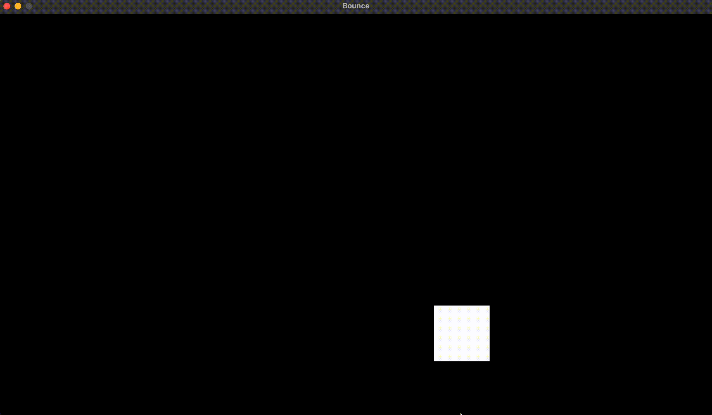

# Bounce
Implemented the old school VCD bounce screen in C using Raylib

## How to run this?
* Setup raylib
    * Clone the raylib source code
    * Follow the instructions to setup
    * Copy over the "raylib.h" header file and "libraylib.a" file to this repo

* Compile the program using `make my_app` command (it uses clang)
* Run the program using `make run`

## Demo
